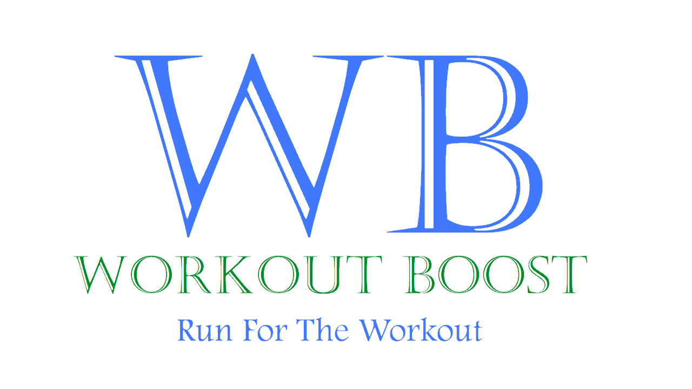
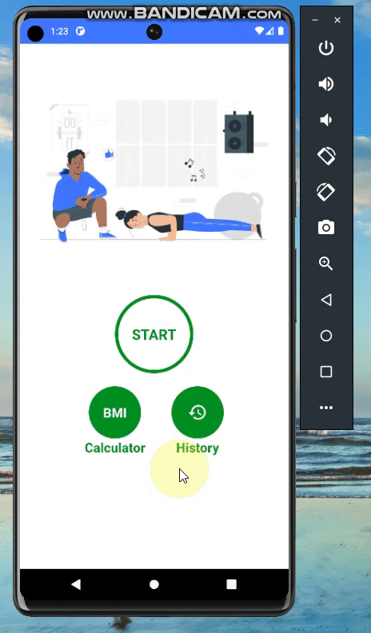
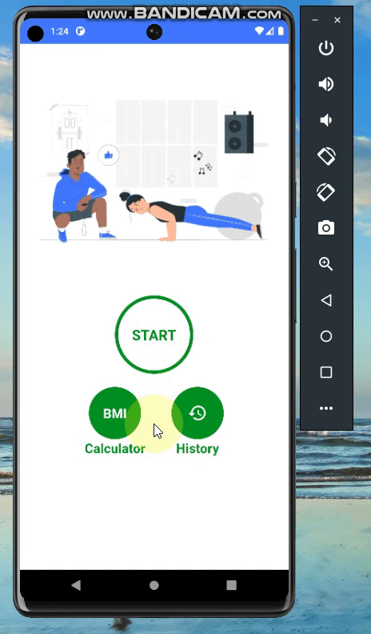

    

# ℹ️ Overview
- Workout Boost is an android native app that tracks your daily workout and calculate your BMI (Metric/US units).
- Used Coroutines, ROOM to save your last workout date locally, text to speech and much more...

# :iphone: Screens
Practice workouts daily

Saves your last workout time locally using ROOM database

Calculates your BMI (Metric/US units)

